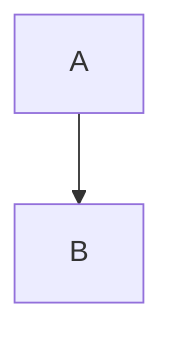
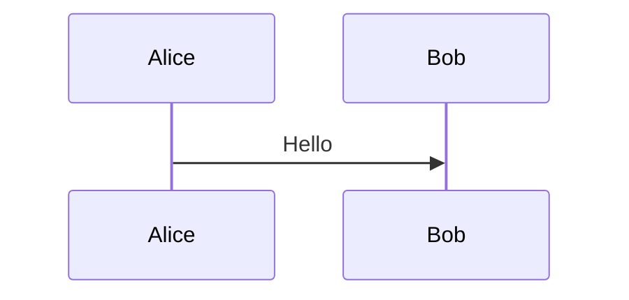

# Beautiful Mermaid

An [Obsidian](https://obsidian.md) plugin that replaces the default Mermaid rendering with [beautiful-mermaid](https://github.com/lukilabs/beautiful-mermaid) — themed, high-quality SVG output for all your diagrams.

## Features

- **15 built-in themes** — Catppuccin (Latte, Frappe, Macchiato, Mocha), Dracula, Nord, Gruvbox, Solarized, Tokyo Night, One Dark, Rose Pine, and more
- **Custom fonts** — use any installed font for diagram text
- **Transparent backgrounds** — render diagrams without a background color
- **ASCII mode** — render diagrams as Unicode box-drawing text
- **Per-diagram overrides** — use `%% ascii` or `%% svg` as the first comment in a mermaid block to override the global default
- **Live Preview support** — diagrams render in both Reading View and Live Preview

## Installation

### From Community Plugins (coming soon)

1. Open **Settings > Community plugins**
2. Search for **Beautiful Mermaid**
3. Click **Install**, then **Enable**

### Manual

1. Download `main.js`, `manifest.json`, and `styles.css` from the [latest release](https://github.com/timk75/obsidian-beautiful-mermaid/releases/latest)
2. Create a folder `beautiful-mermaid` in your vault's `.obsidian/plugins/` directory
3. Copy the three files into that folder
4. Enable the plugin in **Settings > Community plugins**

## Settings

| Setting | Description | Default |
|---------|-------------|---------|
| Default render mode | SVG (themed vector) or ASCII (Unicode box-drawing) | SVG |
| Theme | Color theme for SVG diagrams | catppuccin-latte |
| Font | Font family for diagram text | Inter |
| Transparent background | Render with no background color | Off |

## Available Themes

catppuccin-latte, catppuccin-frappe, catppuccin-macchiato, catppuccin-mocha, dracula, nord, gruvbox-light, gruvbox-dark, solarized-light, solarized-dark, tokyo-night, one-dark, rose-pine, rose-pine-moon, rose-pine-dawn

## Per-Diagram Overrides

Add a `%%` comment directive as the first line of a mermaid code block to override the global render mode:

````markdown

````

````markdown

````

## Credits

Powered by [beautiful-mermaid](https://github.com/lukilabs/beautiful-mermaid).
