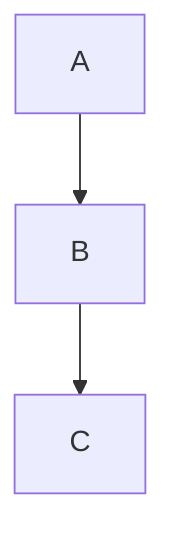

# Beautiful Mermaid — Obsidian Plugin

Replaces Obsidian's default Mermaid rendering with [beautiful-mermaid](https://github.com/timkaiser/beautiful-mermaid), providing themed, high-quality SVG and ASCII output for all Mermaid code blocks.

## Features

- **Themed SVG rendering** — choose from built-in themes (Catppuccin Latte/Mocha, Dracula, Nord, etc.) or define custom colors
- **ASCII mode** — Unicode box-drawing output for text-friendly diagrams
- **Per-diagram overrides** — add `%% ascii` or `%% svg` as the first comment in a code block to override the global default
- **Live Preview support** — renders in both Reading View and CM6 Live Preview
- **Dark/light auto-refresh** — diagrams re-render automatically when you switch Obsidian's appearance mode
- **SVG export** — right-click any rendered diagram to copy SVG to clipboard or export as an `.svg` file
- **Custom theme** — pick your own background and foreground colors; the library auto-derives accent, muted, surface, and border colors
- **Transparent backgrounds** — optional setting to render diagrams with no background fill
- **Configurable font** — set any font family for diagram text

## Settings

| Setting | Description | Default |
|---------|-------------|---------|
| Default render mode | SVG or ASCII | SVG |
| Theme | Built-in theme or Custom | catppuccin-latte |
| Background color | Custom bg (only when theme = Custom) | #ffffff |
| Foreground color | Custom fg (only when theme = Custom) | #000000 |
| Font | Font family for diagram text | Inter |
| Transparent background | Remove background fill from SVGs | Off |

## Installation

1. Copy `main.js` and `manifest.json` to your vault's `.obsidian/plugins/beautiful-mermaid/` directory
2. Enable the plugin in Obsidian Settings > Community Plugins

## Building from source

```bash
npm install
npm run build    # production (minified)
npm run dev      # watch mode (unminified, with sourcemaps)
```

## Per-diagram mode override

Add a `%% ascii` or `%% svg` comment as the first line of your mermaid block:

````markdown

````

## SVG export

Right-click on any rendered SVG diagram to see:
- **Copy SVG to clipboard** — copies the full SVG markup
- **Export as SVG file** — downloads the diagram as `diagram-{timestamp}.svg`
