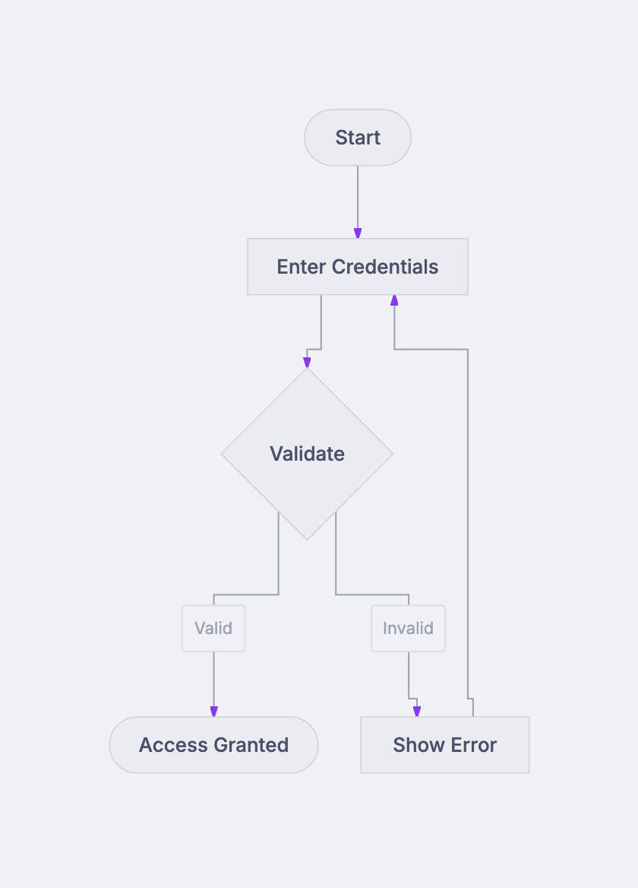
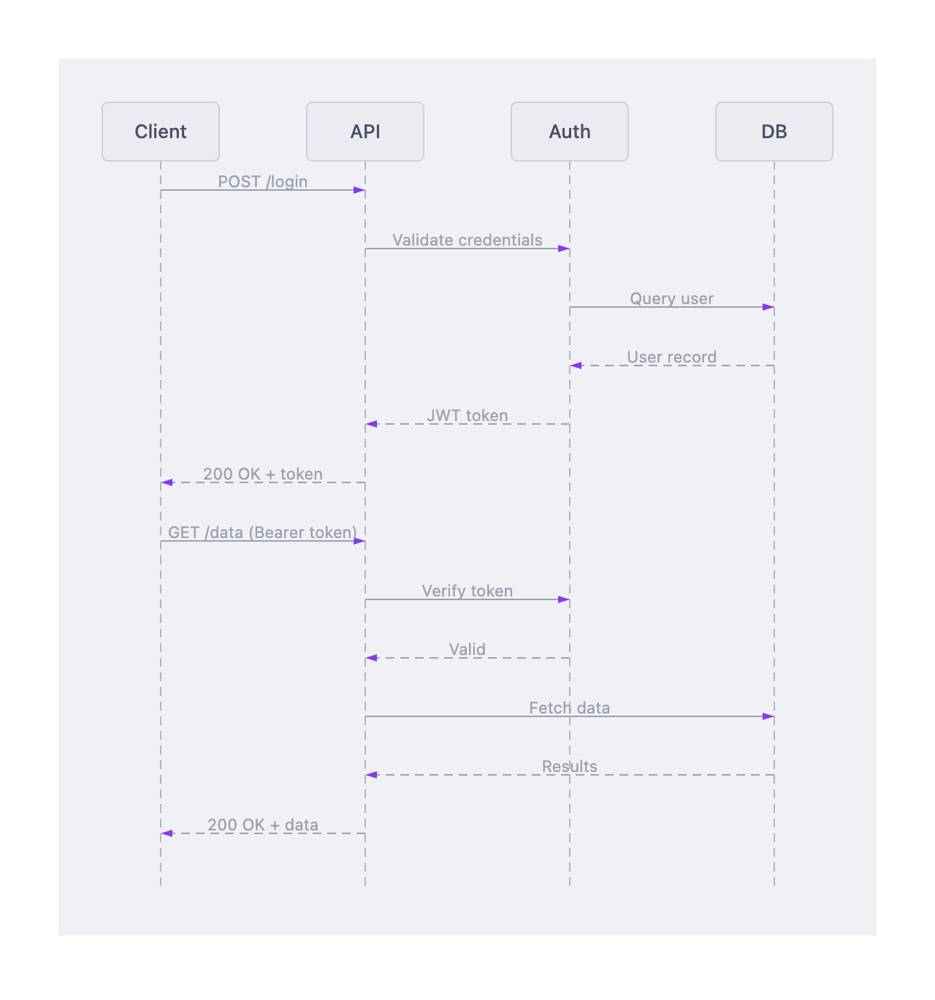
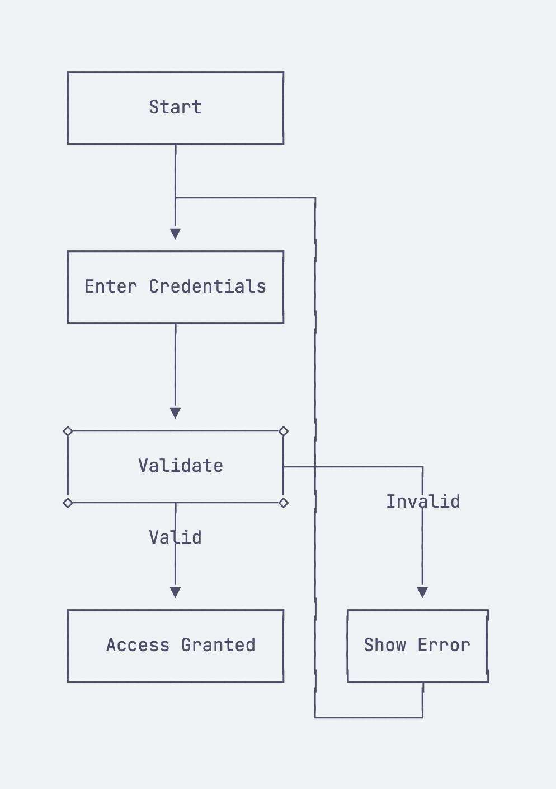
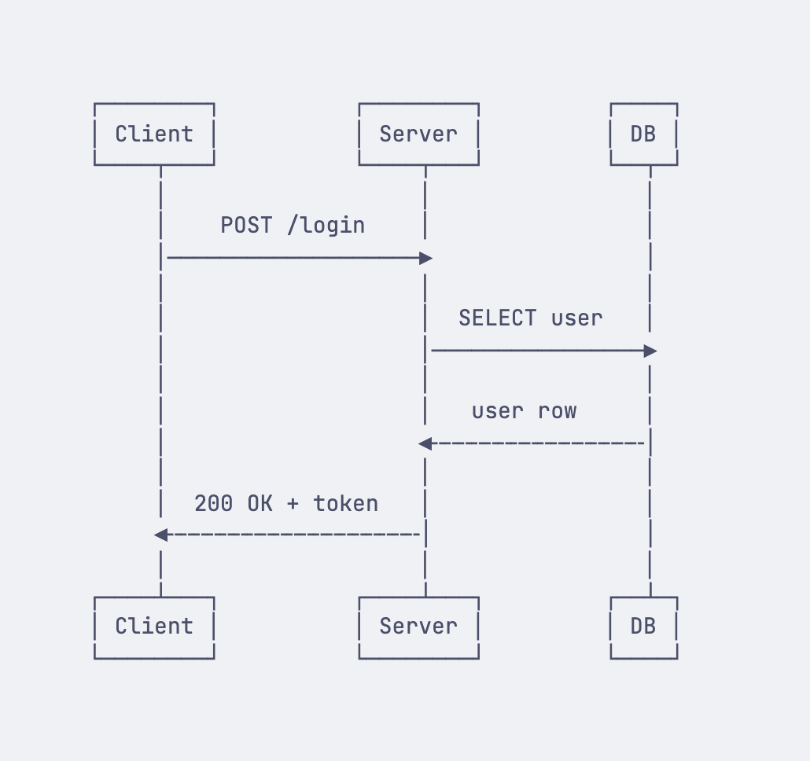
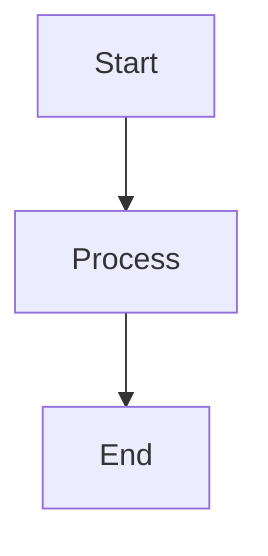
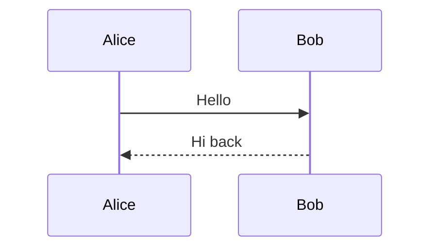

# Beautiful Mermaid

An [Obsidian](https://obsidian.md) plugin that replaces the built-in Mermaid renderer with [beautiful-mermaid](https://github.com/lukilabs/beautiful-mermaid) — a modern rendering engine focused on aesthetics and flexibility.

Obsidian ships with Mermaid support out of the box, but the default renderer offers limited theming and no control over fonts, backgrounds, or output format. This plugin swaps in beautiful-mermaid so every `mermaid` code block in your vault is rendered with the theme, font, and style you choose — in both Reading View and Live Preview.

> We believe beautiful-mermaid represents the future of diagram rendering in note-taking tools. This plugin brings that experience to Obsidian today. If and when Obsidian adopts beautiful-mermaid natively, this plugin will no longer be needed — until then, it bridges the gap.

### SVG Mode (Catppuccin Mocha theme)

| Flowchart | Sequence Diagram |
|:---------:|:----------------:|
|  |  |

### ASCII Mode

| Flowchart | Sequence Diagram |
|:---------:|:----------------:|
|  |  |

See [showcase.md](showcase.md) for all 5 diagram types in both modes — open it in Obsidian with the plugin enabled.

## What It Does

When you enable this plugin, every ` ```mermaid ` code block in your vault is intercepted before Obsidian's default renderer touches it. Instead, the diagram source is passed to beautiful-mermaid, which:

1. **Parses** the Mermaid syntax and calculates layout using ELK.js (synchronous — no async delays)
2. **Renders** a themed SVG using your chosen color palette and font, or optionally renders Unicode box-drawing art for a terminal-style look
3. **Displays** the result inline, exactly where Obsidian would normally show its default diagram

This works in both **Reading View** (via a registered code block processor) and **Live Preview** (via a CodeMirror 6 ViewPlugin that detects rendered mermaid embed blocks and replaces their content).

## Features

- **15 built-in themes** — Catppuccin (Latte, Frappe, Macchiato, Mocha), Dracula, Nord, Gruvbox (Light, Dark), Solarized (Light, Dark), Tokyo Night, One Dark, Rose Pine (default, Moon, Dawn)
- **Custom fonts** — use any font installed on your system for diagram text (default: Inter)
- **Transparent backgrounds** — render SVG diagrams with no background, so they blend with your vault theme
- **ASCII mode** — render diagrams as Unicode box-drawing text instead of SVG, useful for a minimalist or terminal-inspired aesthetic
- **Per-diagram overrides** — add `%% ascii` or `%% svg` as the first comment line in any mermaid block to override the global default for that specific diagram
- **Live Preview support** — diagrams re-render in real time as you edit, not just in Reading View
- **Synchronous rendering** — no flicker or loading states; diagrams appear instantly
- **Two-color foundation** — each theme derives its full palette from background and foreground colors using CSS `color-mix()`, producing harmonious, consistent output

### Supported Diagram Types

- Flowcharts (all directions: TD, LR, BT, RL)
- Sequence diagrams
- State diagrams
- Class diagrams
- ER diagrams

## Installation

### BRAT (recommended for early adopters)

[BRAT](https://github.com/TfTHacker/obsidian42-brat) lets you install plugins directly from GitHub without waiting for community plugin review.

1. Install the **BRAT** plugin from Community Plugins if you haven't already
2. Open **Settings > BRAT > Add Beta plugin**
3. Enter: `timk75/obsidian-beautiful-mermaid`
4. Click **Add Plugin**, then enable **Beautiful Mermaid** in Community Plugins

BRAT will automatically notify you when new versions are released.

### Community Plugins (coming soon)

1. Open **Settings > Community plugins**
2. Search for **Beautiful Mermaid**
3. Click **Install**, then **Enable**

### Manual

1. Download `main.js`, `manifest.json`, and `styles.css` from the [latest release](https://github.com/timk75/obsidian-beautiful-mermaid/releases/latest)
2. Create a folder `beautiful-mermaid` inside your vault's `.obsidian/plugins/` directory
3. Copy the three files into that folder
4. Enable the plugin in **Settings > Community plugins**

## Settings

| Setting | Description | Default |
|---------|-------------|---------|
| Default render mode | SVG (themed vector) or ASCII (Unicode box-drawing) | SVG |
| Theme | Color theme for SVG diagrams | catppuccin-latte |
| Font | Font family for diagram text | Inter |
| Transparent background | Render with no background color | Off |

## Available Themes

| Theme | Style |
|-------|-------|
| catppuccin-latte | Light, pastel |
| catppuccin-frappe | Medium dark, muted |
| catppuccin-macchiato | Dark, warm |
| catppuccin-mocha | Dark, rich |
| dracula | Dark, vibrant |
| nord | Dark, cool blue |
| gruvbox-light | Light, warm retro |
| gruvbox-dark | Dark, warm retro |
| solarized-light | Light, precision |
| solarized-dark | Dark, precision |
| tokyo-night | Dark, neon accents |
| one-dark | Dark, balanced |
| rose-pine | Dark, muted rose |
| rose-pine-moon | Dark, softer rose |
| rose-pine-dawn | Light, warm rose |

## Per-Diagram Overrides

Add a `%%` comment directive as the first line of a mermaid code block to override the global render mode for that specific diagram:

````markdown

````

````markdown

````

This is useful when you want most diagrams in SVG but prefer ASCII for a specific simple flowchart, or vice versa.

## How It Works

The plugin registers two rendering hooks:

1. **Reading View** — a Markdown code block processor (registered at priority -100 to run before Obsidian's built-in mermaid processor) intercepts every `mermaid` block and renders it with beautiful-mermaid
2. **Live Preview** — a CodeMirror 6 `ViewPlugin` watches for `.cm-preview-code-block.cm-lang-mermaid` elements in the editor DOM, extracts the mermaid source from the document state, and replaces the content with beautiful-mermaid output

Both paths share the same rendering logic: parse the settings, check for per-diagram `%% ascii`/`%% svg` directives, and call the appropriate beautiful-mermaid render function.

A marker attribute (`data-beautiful-mermaid`) tracks which blocks have been processed and with which settings, so diagrams only re-render when the source or settings actually change.

## Versioning and Releases

This plugin tracks the [beautiful-mermaid](https://github.com/lukilabs/beautiful-mermaid) npm package. When a new version of beautiful-mermaid is released with new features, themes, or diagram type support, we publish a corresponding plugin update to bring those improvements to Obsidian.

- **Plugin version** follows semver independently, but each release notes which beautiful-mermaid version it includes
- **Release artifacts** (`main.js`, `manifest.json`, `styles.css`) are built automatically via GitHub Actions on every tagged release

## Roadmap

- Support for additional diagram types as beautiful-mermaid adds them
- Custom theme support (define your own background/foreground colors)
- Export diagrams as standalone SVG files

## Credits

Powered by [beautiful-mermaid](https://github.com/lukilabs/beautiful-mermaid) by [Luki Labs](https://github.com/lukilabs).

## License

[MIT](LICENSE)
