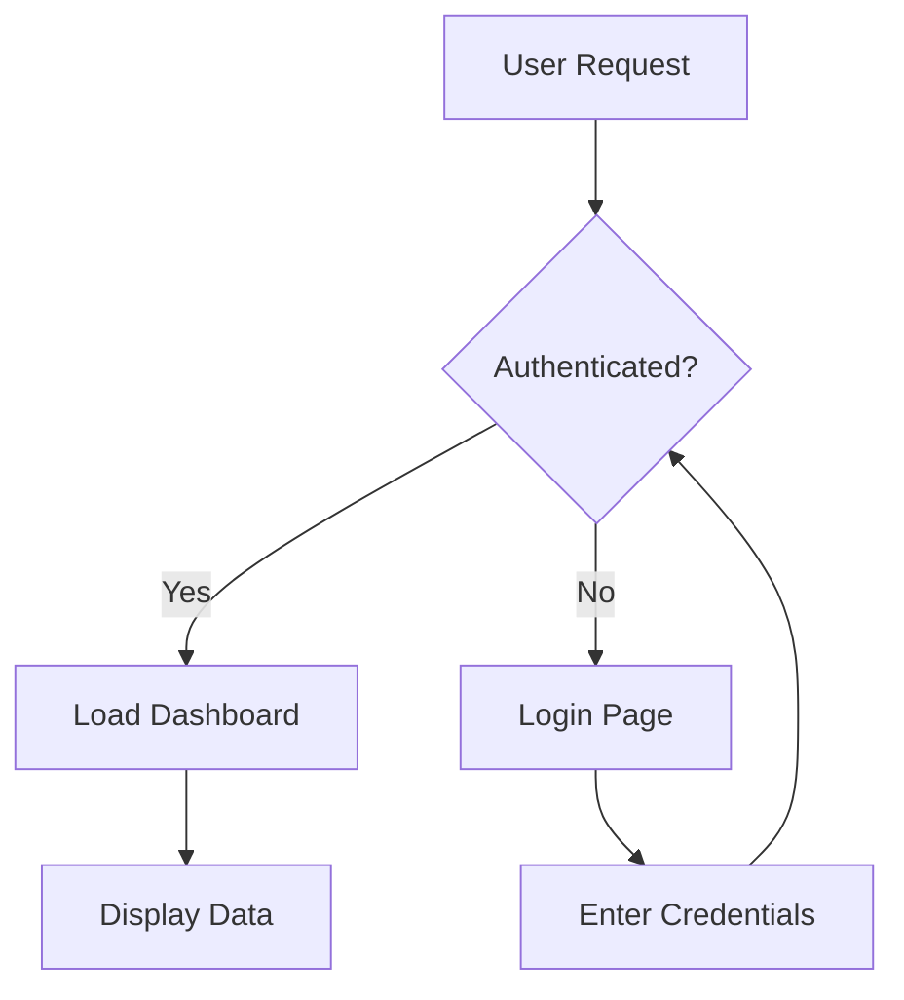
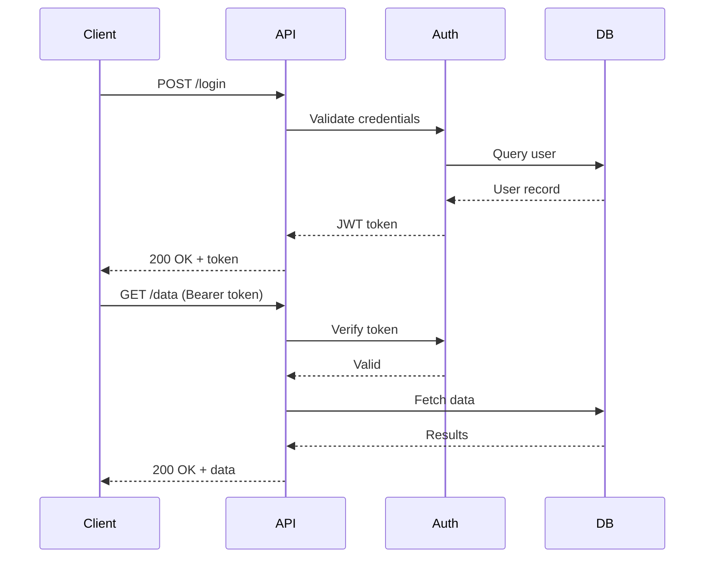
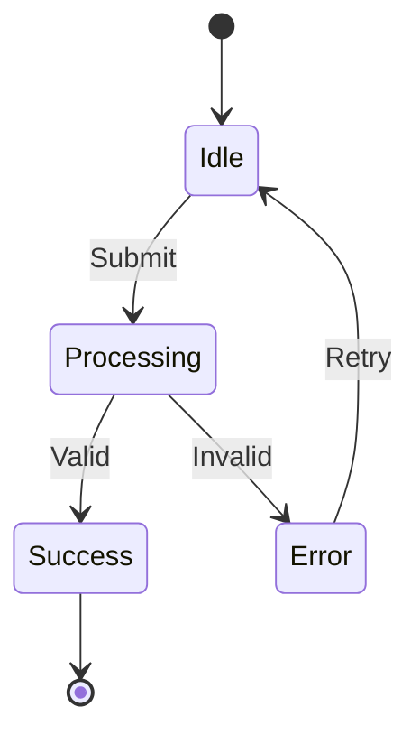
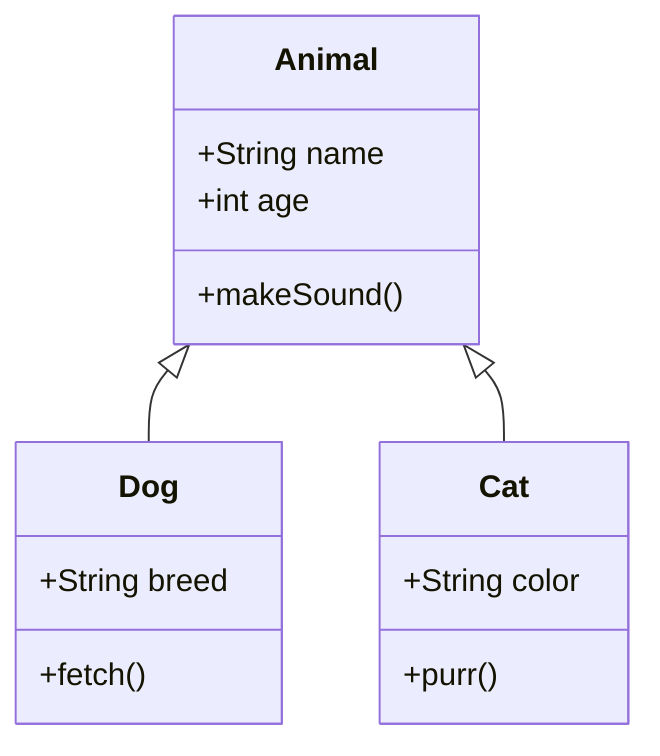
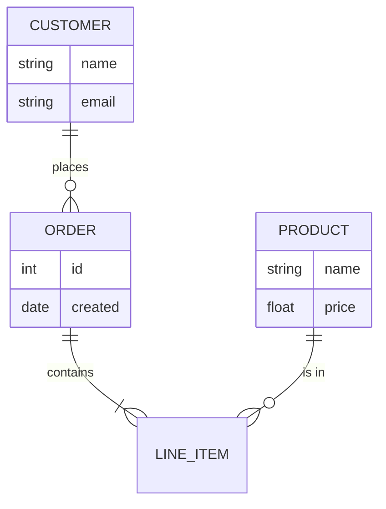

# Beautiful Mermaid — Showcase

Open this file in Obsidian with the Beautiful Mermaid plugin enabled to see all diagram types rendered with themed SVG and ASCII modes.

Each diagram is shown twice: once in **SVG mode** (default) and once in **ASCII mode** using the `%% ascii` directive.

---

## 1. Flowchart

### SVG

### ASCII

---

## 2. Sequence Diagram

### SVG

### ASCII

---

## 3. State Diagram

### SVG

### ASCII

---

## 4. Class Diagram

### SVG

### ASCII

---

## 5. ER Diagram

### SVG

### ASCII

