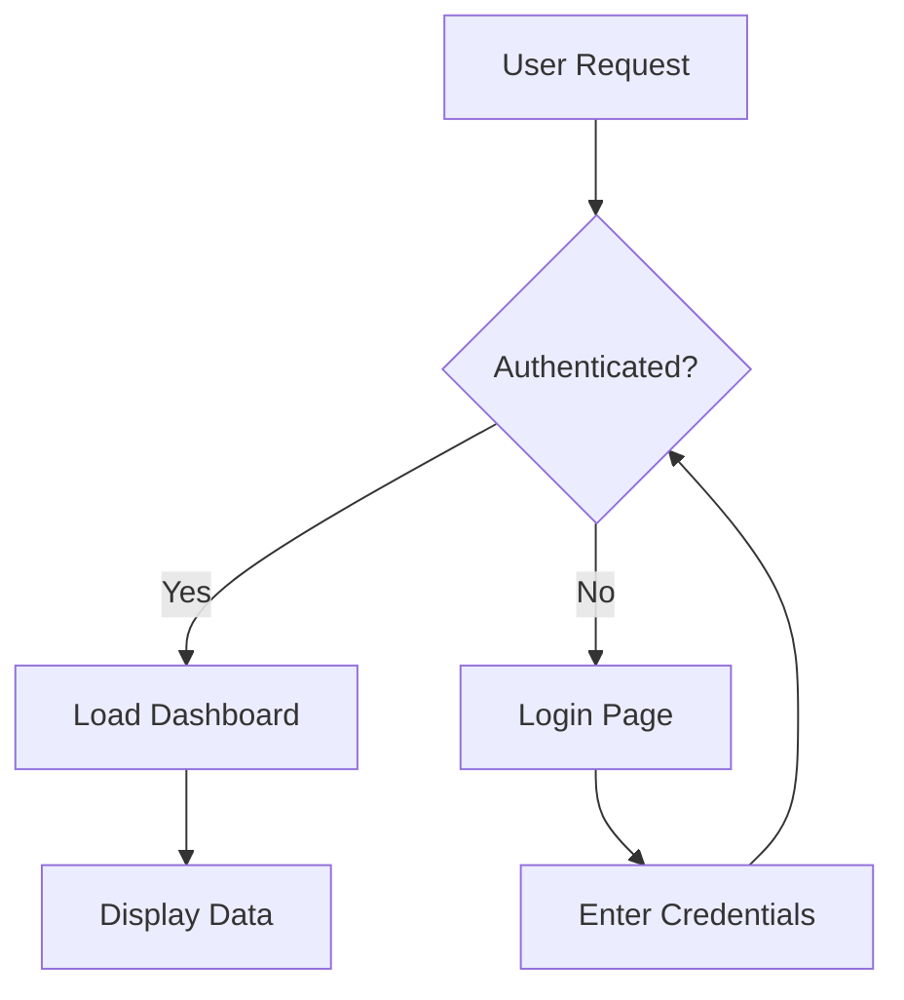
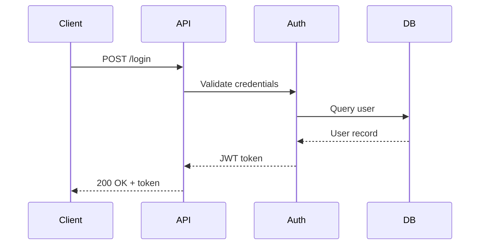
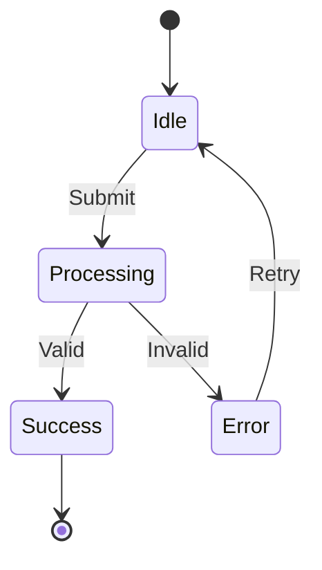
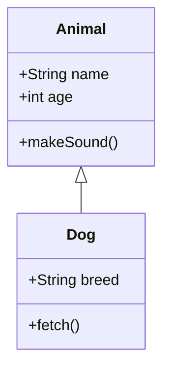
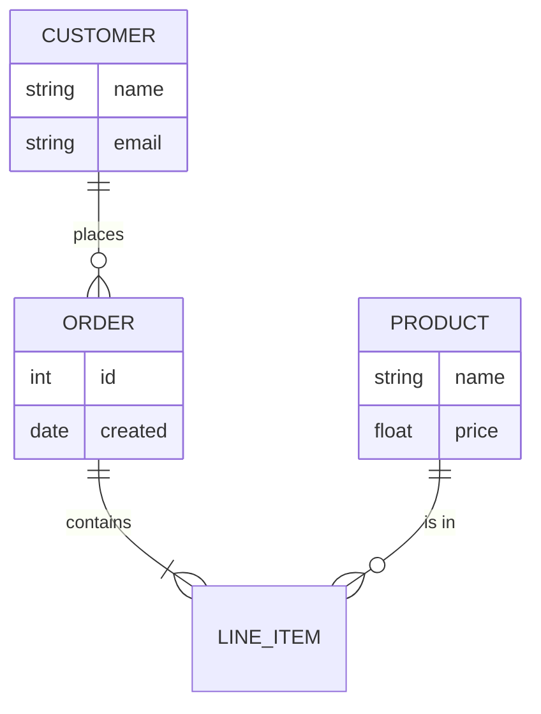
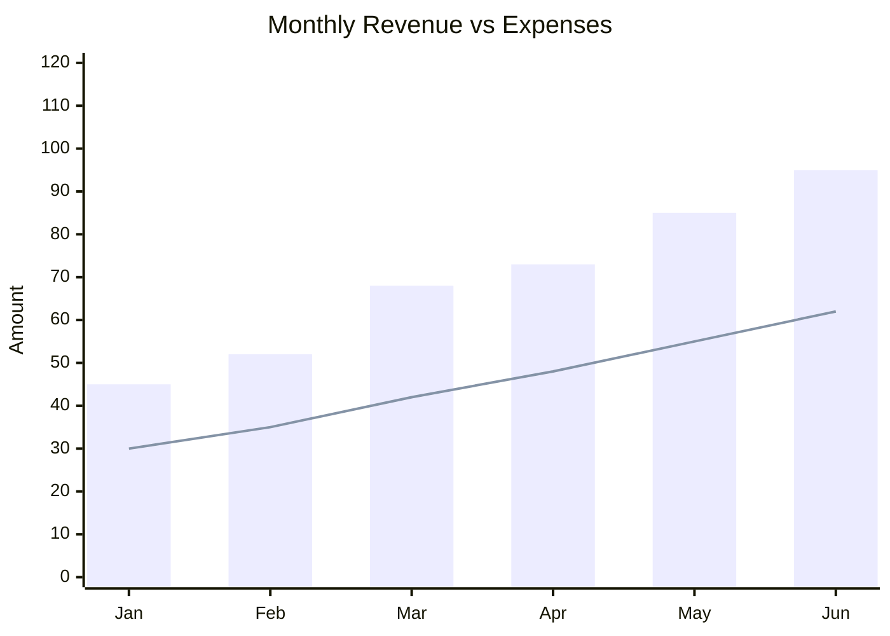

# Beautiful Mermaid — Showcase

Each diagram appears twice: the **SVG** block renders live via Mermaid on GitHub; the **ASCII** block is the actual Unicode box-drawing output the plugin produces from the `%% ascii` directive inside Obsidian.

> The ASCII blocks are pre-rendered (GitHub cannot run the plugin). In Obsidian, add `%% ascii` as the first line of a mermaid block to get this live.

## 1. Flowchart

### SVG


```mermaid
graph TD
    A[User Request] --> B{Authenticated?}
    B -->|Yes| C[Load Dashboard]
    B -->|No| D[Login Page]
    D --> E[Enter Credentials]
    E --> B
    C --> F[Display Data]
```

### ASCII

```text
┌────────────────┐                          
│                │                          
│  User Request  │                          
│                │                          
└────────┬───────┘                          
         │                                  
         │                                  
         ├──────────┐                       
         │          │                       
         ▼          │                       
◇────────────────◇  │                       
│                │  │                       
│ Authenticated? ├──┼────────────┐          
│                │  │            │          
◇────────┬───────◇  │           No          
         │          │            │          
        Yes         │            │          
         │          │            │          
         │          │            │          
         ▼          │            ▼          
┌────────────────┐  │  ┌───────────────────┐
│                │  │  │                   │
│ Load Dashboard │  │  │     Login Page    │
│                │  │  │                   │
└────────┬───────┘  │  └─────────┬─────────┘
         │          │            │          
         │          │            │          
         │          │            │          
         │          │            │          
         ▼          │            ▼          
┌────────────────┐  │  ┌───────────────────┐
│                │  │  │                   │
│  Display Data  │  │  │ Enter Credentials │
│                │  │  │                   │
└────────────────┘  │  └─────────┬─────────┘
                    │            │          
                    └────────────┘          
```

## 2. Sequence Diagram

### SVG


```mermaid
sequenceDiagram
    participant Client
    participant API
    participant Auth
    participant DB
    Client->>API: POST /login
    API->>Auth: Validate credentials
    Auth->>DB: Query user
    DB-->>Auth: User record
    Auth-->>API: JWT token
    API-->>Client: 200 OK + token
```

### ASCII

```text
┌────────┐            ┌─────┐                  ┌──────┐          ┌────┐   
│ Client │            │ API │                  │ Auth │          │ DB │   
└────┬───┘            └──┬──┘                  └───┬──┘          └──┬─┘   
     │                   │                         │                │     
     │    POST /login    │                         │                │     
     │───────────────────▶                         │                │     
     │                   │                         │                │     
     │                   │  Validate credentials   │                │     
     │                   │─────────────────────────▶                │     
     │                   │                         │                │     
     │                   │                         │  Query user    │     
     │                   │                         │────────────────▶     
     │                   │                         │                │     
     │                   │                         │  User record   │     
     │                   │                         ◀╌╌╌╌╌╌╌╌╌╌╌╌╌╌╌╌│     
     │                   │                         │                │     
     │                   │        JWT token        │                │     
     │                   ◀╌╌╌╌╌╌╌╌╌╌╌╌╌╌╌╌╌╌╌╌╌╌╌╌╌│                │     
     │                   │                         │                │     
     │  200 OK + token   │                         │                │     
     ◀╌╌╌╌╌╌╌╌╌╌╌╌╌╌╌╌╌╌╌│                         │                │     
     │                   │                         │                │     
┌────┴───┐            ┌──┴──┐                  ┌───┴──┐          ┌──┴─┐   
│ Client │            │ API │                  │ Auth │          │ DB │   
└────────┘            └─────┘                  └──────┘          └────┘   
```

## 3. State Diagram

### SVG


```mermaid
stateDiagram-v2
    [*] --> Idle
    Idle --> Processing : Submit
    Processing --> Success : Valid
    Processing --> Error : Invalid
    Error --> Idle : Retry
    Success --> [*]
```

### ASCII

```text
●────────────●                  
│            │                  
●────────────●                  
       │                        
       │                        
       │                        
       │                        
       ▼                        
╭────────────╮                  
│            │                  
│    Idle    │◄──Retry────┐     
│            │            │     
╰──────┬─────╯            │     
       │                  │     
    Submit                │     
       │                  │     
       │                  │     
       ▼                  │     
╭────────────╮            │     
│            │            │     
│ Processing ├────────────┤     
│            │            │     
╰──────┬─────╯         Invalid  
       │                  │     
     Valid                │     
       │                  │     
       │                  │     
       ▼                  ▼     
╭────────────╮       ╭────┴────╮
│            │       │         │
│  Success   │       │  Error  │
│            │       │         │
╰──────┬─────╯       ╰─────────╯
       │                        
       │                        
       │                        
       │                        
       ▼                        
╔════════════╗                  
║            ║                  
╚════════════╝                  
```

## 4. Class Diagram

### SVG


```mermaid
classDiagram
    class Animal {
        +String name
        +int age
        +makeSound()
    }
    class Dog {
        +String breed
        +fetch()
    }
    Animal <|-- Dog
```

### ASCII

```text
┌───────────────┐     
│ Animal        │     
├───────────────┤     
│ +name: String │     
│ +age: int     │     
├───────────────┤     
│ +makeSound    │     
└───────────────┘     
        △             
        └┐            
         │            
┌────────────────┐    
│ Dog            │    
├────────────────┤    
│ +breed: String │    
├────────────────┤    
│ +fetch         │    
└────────────────┘    
                      
                      
```

## 5. ER Diagram

### SVG


```mermaid
erDiagram
    CUSTOMER ||--o{ ORDER : places
    ORDER ||--|{ LINE_ITEM : contains
    PRODUCT ||--o{ LINE_ITEM : "is in"
    CUSTOMER {
        string name
        string email
    }
    ORDER {
        int id
        date created
    }
    PRODUCT {
        string name
        float price
    }
```

### ASCII

```text
┌─────────────────┐      ┌─────────────────┐    
│ CUSTOMER        │      │ ORDER           │    
├─────────────────┤      ├─────────────────┤    
│    string name  ││───○╟│    int id       │    
│    string email │places│    date created │    
└─────────────────┘      └─────────────────┘    
                                  │             
      ───────────────────────────── contains    
      │                           │             
      ╟                           │             
┌───────────┐      ┌────────────────┐           
│ LINE_ITEM │╢○───││ PRODUCT        │           
└───────────┘is in ├────────────────┤           
                   │    string name │           
                   │    float price │           
                   └────────────────┘           
                                                
                                                
```

## 6. XY Chart

### SVG


```mermaid
xychart-beta
    title "Monthly Revenue vs Expenses"
    x-axis [Jan, Feb, Mar, Apr, May, Jun]
    y-axis "Amount" 0 --> 120
    bar [45, 52, 68, 73, 85, 95]
    line [30, 35, 42, 48, 55, 62]
```

### ASCII

```text
                    Monthly Revenue vs Expenses
                         █ Bar 1  ─ Line 1

 120┤····························································
    │
    │
 100┤····························································
    │                                                   ████████
    │                                                   ████████
  80┤·········································████████··████████·
    │                               ████████  ████████  ████████
    │                     ████████  ████████  ████████  ████████
  60┤·····················████████··████████··████████·╭───────█·
    │                     ████████  ████████ ╭─────────╯████████
    │           ████████  ████████ ╭─────────╯████████  ████████
    │ ████████  ████████ ╭─────────╯████████  ████████  ████████
  40┤·████████·╭─────────╯████████··████████··████████··████████·
    │ ██───────╯████████  ████████  ████████  ████████  ████████
    │ ████████  ████████  ████████  ████████  ████████  ████████
  20┤·████████··████████··████████··████████··████████··████████·
    │ ████████  ████████  ████████  ████████  ████████  ████████
    │ ████████  ████████  ████████  ████████  ████████  ████████
   0┼·████████··████████··████████··████████··████████··████████·
    ┼─────┬─────────┬─────────┬─────────┬─────────┬─────────┬────
         Jan       Feb       Mar       Apr       May       Jun
```
